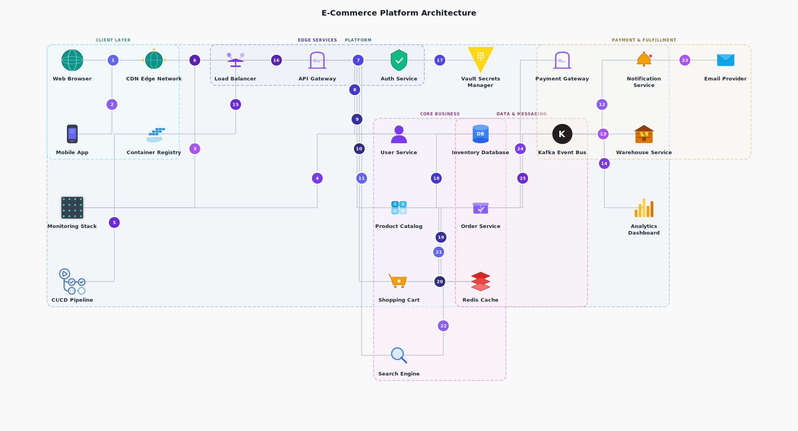
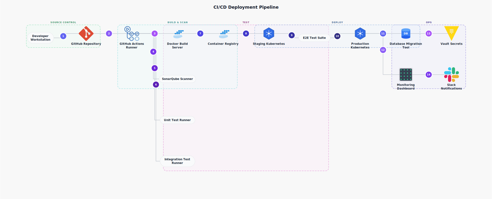
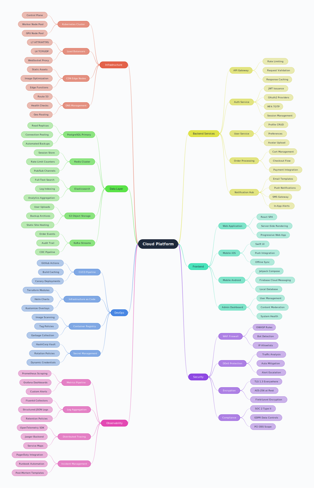
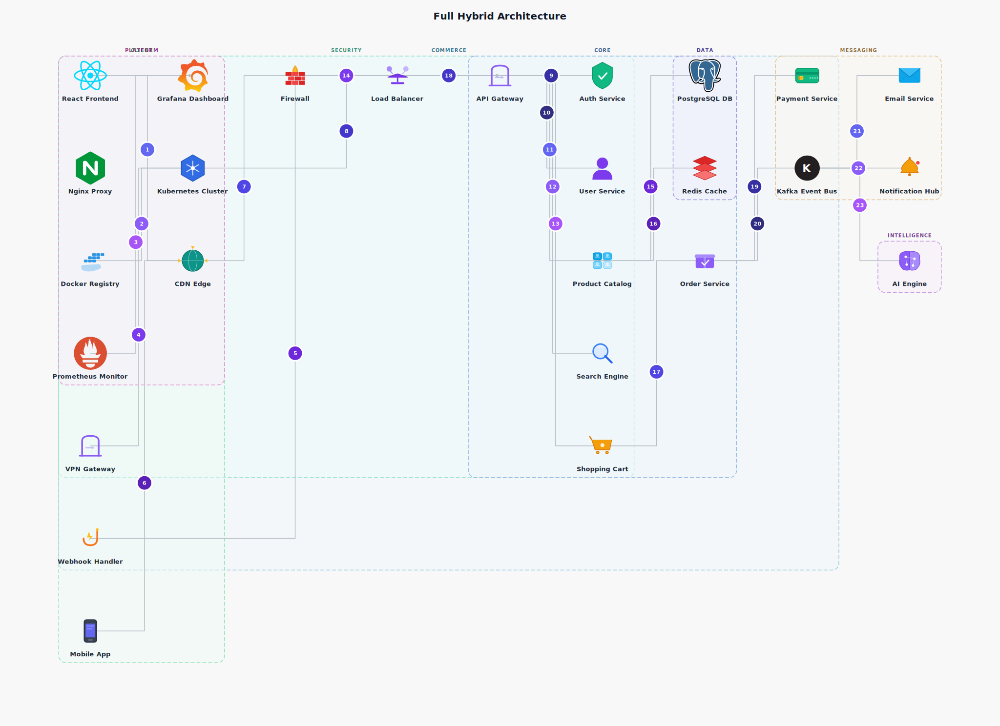

# Vizdown-MCP — Diagram Gallery

> Every diagram below was generated from plain Markdown using Vizdown-MCP.
> No design tools, no drag-and-drop — just text in, SVG out.

---

## 1. E-Commerce Microservices Architecture

A production-grade e-commerce platform with 22 services across 6 groups — from
browser through CDN, load balancer, API gateway, into core business services,
event-driven pipelines, data stores, and observability.

**Source:** [`examples/microservices.md`](examples/microservices.md)



<details>
<summary>Markdown source</summary>

````
```architecture
title: E-Commerce Platform Architecture

services:
  Web Browser
  Mobile App
  CDN Edge Network
  Load Balancer
  API Gateway
  Auth Service
  User Service
  Product Catalog
  Search Engine
  Shopping Cart
  Order Service
  Payment Gateway
  Inventory Database
  Notification Service
  Email Provider
  Redis Cache
  Kafka Event Bus
  Warehouse Service
  Analytics Dashboard
  Monitoring Stack
  CI/CD Pipeline
  Vault Secrets Manager
  Container Registry

flow:
  Web Browser -> CDN Edge Network
  Mobile App -> CDN Edge Network
  CDN Edge Network -> Load Balancer
  Load Balancer -> API Gateway
  API Gateway -> Auth Service
  Auth Service -> Vault Secrets Manager
  API Gateway -> User Service
  API Gateway -> Product Catalog
  API Gateway -> Shopping Cart
  API Gateway -> Search Engine
  Product Catalog -> Inventory Database
  Product Catalog -> Redis Cache
  Search Engine -> Redis Cache
  Shopping Cart -> Redis Cache
  Shopping Cart -> Order Service
  Order Service -> Payment Gateway
  Order Service -> Kafka Event Bus
  Kafka Event Bus -> Notification Service
  Kafka Event Bus -> Warehouse Service
  Kafka Event Bus -> Analytics Dashboard
  Notification Service -> Email Provider
  Monitoring Stack -> API Gateway
  Monitoring Stack -> Kafka Event Bus
  CI/CD Pipeline -> Container Registry
  Container Registry -> API Gateway

groups:
  Client Layer: Web Browser, Mobile App, CDN Edge Network
  Edge Services: Load Balancer, API Gateway, Auth Service
  Core Business: User Service, Product Catalog, Search Engine, Shopping Cart, Order Service
  Payment & Fulfillment: Payment Gateway, Warehouse Service, Notification Service, Email Provider
  Data & Messaging: Inventory Database, Redis Cache, Kafka Event Bus
  Platform: Monitoring Stack, Analytics Dashboard, CI/CD Pipeline, Vault Secrets Manager, Container Registry
```
````

</details>

---

## 2. CI/CD Deployment Pipeline

Full deployment pipeline from developer push through build, test, staging,
and production — 15 services across 5 groups with auto-detected icons.

**Source:** [`examples/ci_cd_pipeline.md`](examples/ci_cd_pipeline.md)



<details>
<summary>Markdown source</summary>

````
```architecture
title: CI/CD Deployment Pipeline

services:
  Developer Workstation
  GitHub Repository
  GitHub Actions Runner
  Docker Build Server
  Container Registry
  SonarQube Scanner
  Unit Test Runner
  Integration Test Runner
  E2E Test Suite
  Staging Kubernetes
  Production Kubernetes
  Database Migration Tool
  Vault Secrets
  Monitoring Dashboard
  Slack Notifications

flow:
  Developer Workstation -> GitHub Repository
  GitHub Repository -> GitHub Actions Runner
  GitHub Actions Runner -> Docker Build Server
  Docker Build Server -> Container Registry
  GitHub Actions Runner -> SonarQube Scanner
  GitHub Actions Runner -> Unit Test Runner
  GitHub Actions Runner -> Integration Test Runner
  Container Registry -> Staging Kubernetes
  Staging Kubernetes -> E2E Test Suite
  E2E Test Suite -> Production Kubernetes
  Production Kubernetes -> Database Migration Tool
  Database Migration Tool -> Vault Secrets
  Production Kubernetes -> Monitoring Dashboard
  Monitoring Dashboard -> Slack Notifications

groups:
  Source Control: Developer Workstation, GitHub Repository
  Build & Scan: GitHub Actions Runner, Docker Build Server, Container Registry, SonarQube Scanner
  Test: Unit Test Runner, Integration Test Runner, E2E Test Suite
  Deploy: Staging Kubernetes, Production Kubernetes, Database Migration Tool
  Ops: Vault Secrets, Monitoring Dashboard, Slack Notifications
```
````

</details>

---

## 3. Cloud Platform System Overview (Mind Map)

A comprehensive mind map of a cloud-native SaaS platform — 7 domains,
30+ sub-systems, 100+ leaf nodes — rendered as a balanced horizontal tree
with organic Bezier connectors.

**Source:** [`examples/system_overview.md`](examples/system_overview.md)



<details>
<summary>Markdown source</summary>

````
```mindmap
mindmap
  Cloud Platform
    Infrastructure
      Kubernetes Cluster
        Control Plane
        Worker Node Pool
        GPU Node Pool
      Load Balancers
        L7 HTTP/HTTPS
        L4 TCP/UDP
        WebSocket Proxy
      CDN Edge Nodes
        Static Assets
        Image Optimization
        Edge Functions
      DNS Management
        Route 53
        Health Checks
        Geo Routing
    Backend Services
      API Gateway
        Rate Limiting
        Request Validation
        Response Caching
      Auth Service
        JWT Issuance
        OAuth2 Providers
        MFA TOTP
        Session Management
      User Service
        Profile CRUD
        Preferences
        Avatar Upload
      Order Processing
        Cart Management
        Checkout Flow
        Payment Integration
      Notification Hub
        Email Templates
        Push Notifications
        SMS Gateway
        In-App Alerts
    Data Layer
      PostgreSQL Primary
        Read Replicas
        Connection Pooling
        Automated Backups
      Redis Cluster
        Session Store
        Rate Limit Counters
        Pub/Sub Channels
      Elasticsearch
        Full-Text Search
        Log Indexing
        Analytics Aggregation
      S3 Object Storage
        User Uploads
        Backup Archives
        Static Site Hosting
      Kafka Streams
        Order Events
        Audit Trail
        CDC Pipeline
    Frontend
      Web Application
        React SPA
        Server-Side Rendering
        Progressive Web App
      Mobile iOS
        Swift UI
        Push Integration
        Offline Sync
      Mobile Android
        Jetpack Compose
        Firebase Cloud Messaging
        Local Database
      Admin Dashboard
        User Management
        Content Moderation
        System Health
    DevOps
      CI/CD Pipeline
        GitHub Actions
        Build Caching
        Canary Deployments
      Infrastructure as Code
        Terraform Modules
        Helm Charts
        Kustomize Overlays
      Container Registry
        Image Scanning
        Tag Policies
        Garbage Collection
      Secret Management
        HashiCorp Vault
        Rotation Policies
        Dynamic Credentials
    Security
      WAF Firewall
        OWASP Rules
        Bot Detection
        IP Allowlists
      DDoS Protection
        Traffic Analysis
        Auto Mitigation
        Alert Escalation
      Encryption
        TLS 1.3 Everywhere
        AES-256 at Rest
        Field-Level Encryption
      Compliance
        SOC 2 Type II
        GDPR Data Controls
        PCI DSS Scope
    Observability
      Metrics Pipeline
        Prometheus Scraping
        Grafana Dashboards
        Custom Alerts
      Log Aggregation
        Fluentd Collectors
        Structured JSON Logs
        Retention Policies
      Distributed Tracing
        OpenTelemetry SDK
        Jaeger Backend
        Service Maps
      Incident Management
        PagerDuty Integration
        Runbook Automation
        Post-Mortem Templates
```
````

</details>

---

## 4. Hybrid Icon Demo — Hand-Crafted + Brand Logos

Showcases the full icon system: 44 hand-crafted multi-color icons for generic
concepts (database, shield, cloud, API, gateway, etc.) blended with Iconify
brand logos (React, Kafka, Docker, Kubernetes, Redis) — all rendered at a
consistent 68px within the architecture diagram.



---

## How It Works

1. Write your diagram in a Markdown fenced block (`architecture`, `mindmap`, or any Mermaid type)
2. Vizdown-MCP auto-detects the diagram type and picks the right renderer
3. Architecture diagrams get **auto-icon detection** — service names are matched against 44 built-in icons + 70 brand logos
4. Output is a clean, self-contained SVG — no external dependencies

```
You → Markdown → Vizdown-MCP → SVG/PNG/PDF
```

---

## Icon System

| Category | Count | Source | Examples |
|----------|-------|--------|----------|
| Hand-crafted generics | 44 | Python SVG functions | database, shield, cloud, API, gateway, cart, search, brain, firewall |
| Brand logos | 70 | Iconify CDN (cached locally) | React, Vue, Angular, Docker, Kubernetes, AWS, Kafka, Redis |
| Auto-detection keywords | 120+ | `KEYWORD_ICON_MAP` | "auth" → shield, "kafka" → kafka logo, "redis" → redis logo |

All generic icons render at a universal 68px with multi-color gradients.
Brand logos are scaled proportionally from their native viewBox.

---

*Generated by [Vizdown-MCP](https://github.com/rutika196/vizdown-mcp)*
