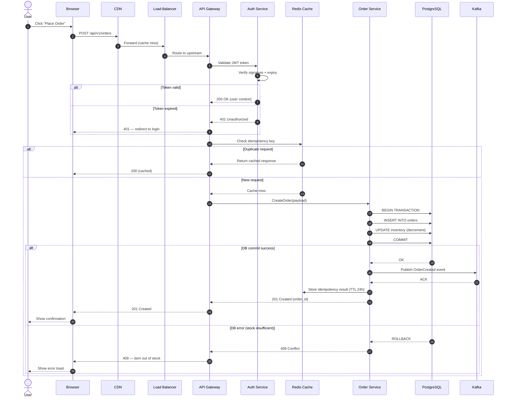

# API Request Lifecycle — Sequence Diagram

Traces a single authenticated API request from the browser through every layer:
CDN, load balancer, API gateway, auth, business logic, cache, database, and
back — including error handling and cache miss/hit paths.

