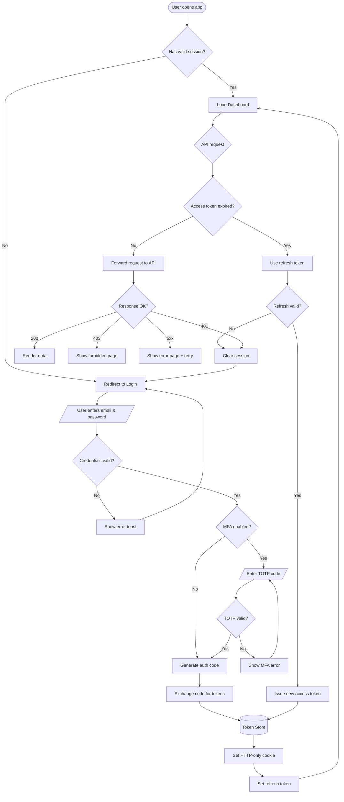

# OAuth 2.0 Authentication Flow

This diagram shows the complete OAuth 2.0 authorization code flow with PKCE,
including token refresh, session management, and error handling paths.

## Flow Summary

1. **Entry** — Check for existing valid session
2. **Login** — Email/password with optional MFA (TOTP)
3. **Token exchange** — Auth code → access + refresh tokens
4. **Session** — HTTP-only cookies, automatic refresh
5. **Error paths** — 401 forces re-auth, 403 shows forbidden, 5xx retries
