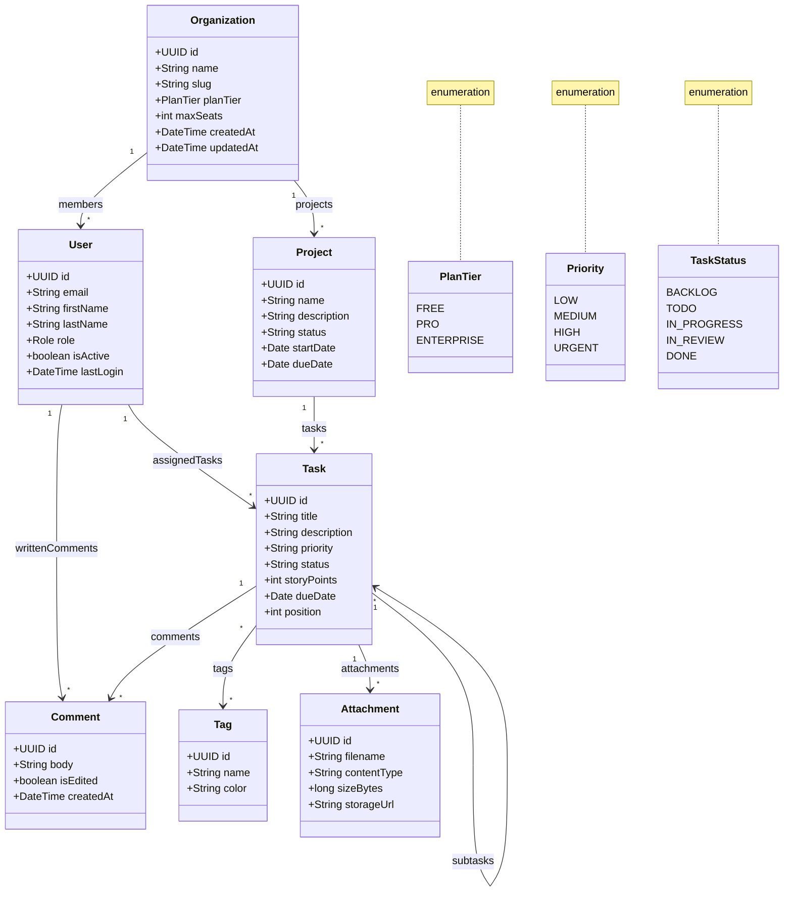

# Domain Model — Class Diagram

Object-oriented domain model for a task management system showing
entities, value objects, enumerations, and their relationships.

```mermaid
classDiagram
    class Organization {
        +UUID id
        +String name
        +String slug
        +PlanTier planTier
        +int maxSeats
        +DateTime createdAt
        +DateTime updatedAt
    }

    class User {
        +UUID id
        +String email
        +String firstName
        +String lastName
        +Role role
        +boolean isActive
        +DateTime lastLogin
    }

    class Project {
        +UUID id
        +String name
        +String description
        +String status
        +Date startDate
        +Date dueDate
    }

    class Task {
        +UUID id
        +String title
        +String description
        +String priority
        +String status
        +int storyPoints
        +Date dueDate
        +int position
    }

    class Comment {
        +UUID id
        +String body
        +boolean isEdited
        +DateTime createdAt
    }

    class Tag {
        +UUID id
        +String name
        +String color
    }

    class Attachment {
        +UUID id
        +String filename
        +String contentType
        +long sizeBytes
        +String storageUrl
    }

    class PlanTier {
        FREE
        PRO
        ENTERPRISE
    }
    note for PlanTier "enumeration"

    class Priority {
        LOW
        MEDIUM
        HIGH
        URGENT
    }
    note for Priority "enumeration"

    class TaskStatus {
        BACKLOG
        TODO
        IN_PROGRESS
        IN_REVIEW
        DONE
    }
    note for TaskStatus "enumeration"

    Organization "1" --> "*" User : members
    Organization "1" --> "*" Project : projects
    User "1" --> "*" Task : assignedTasks
    User "1" --> "*" Comment : writtenComments
    Project "1" --> "*" Task : tasks
    Task "1" --> "*" Task : subtasks
    Task "1" --> "*" Comment : comments
    Task "1" --> "*" Attachment : attachments
    Task "*" --> "*" Tag : tags
```
