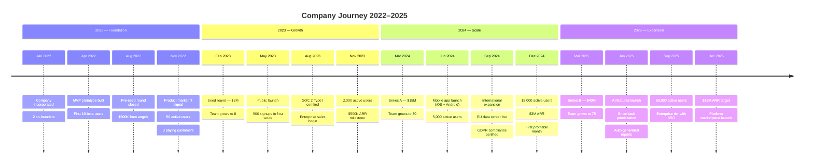

# Company Milestones Timeline

Key milestones from founding through Series B, product launches, and
team growth across 2022–2025.

```mermaid
timeline
    title Company Journey 2022–2025

    section 2022 — Foundation
        Jan 2022 : Company incorporated
                 : 2 co-founders
        Apr 2022 : MVP prototype built
                 : First 10 beta users
        Aug 2022 : Pre-seed round closed
                 : $500K from angels
        Nov 2022 : Product-market fit signal
                 : 50 active users
                 : 3 paying customers

    section 2023 — Growth
        Feb 2023 : Seed round — $3M
                 : Team grows to 8
        May 2023 : Public launch
                 : 500 signups in first week
        Aug 2023 : SOC 2 Type I certified
                 : Enterprise sales begin
        Nov 2023 : 2,000 active users
                 : $500K ARR milestone

    section 2024 — Scale
        Mar 2024 : Series A — $15M
                 : Team grows to 30
        Jun 2024 : Mobile app launch (iOS + Android)
                 : 5,000 active users
        Sep 2024 : International expansion
                 : EU data center live
                 : GDPR compliance certified
        Dec 2024 : 15,000 active users
                 : $3M ARR
                 : First profitable month

    section 2025 — Expansion
        Mar 2025 : Series B — $40M
                 : Team grows to 75
        Jun 2025 : AI features launch
                 : Smart task prioritization
                 : Auto-generated reports
        Sep 2025 : 50,000 active users
                 : Enterprise tier with SSO
        Dec 2025 : $12M ARR target
                 : Platform marketplace launch
```
