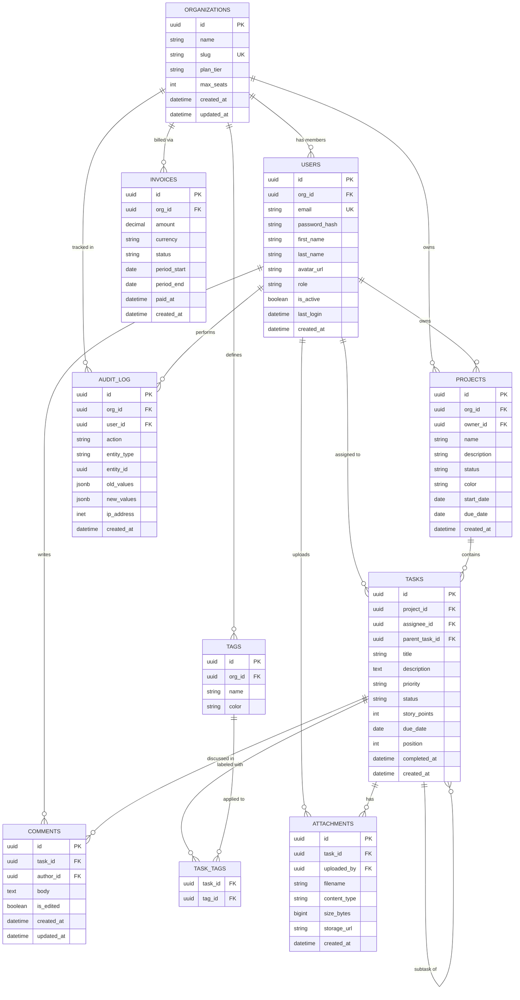

# SaaS Multi-Tenant Database Schema

Full relational schema for a multi-tenant SaaS platform with organizations,
users, roles, projects, tasks, comments, billing, and audit logging.

## Schema Notes

- **Multi-tenancy** via `org_id` foreign key on most tables
- **Hierarchical tasks** — `parent_task_id` self-reference for subtasks
- **Soft positions** — `position` integer for drag-and-drop reordering within projects
- **Audit trail** — Every mutation logged with old/new JSON values + IP address
- **Billing** — Invoices track per-period charges with payment status
