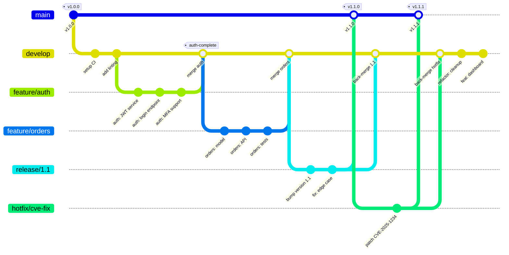

# Git Branching Strategy

Our team's Git workflow: main → develop → feature branches, with release
branches and hotfix support. Shows the full lifecycle of a feature from
creation through review, merge, release, and hotfix.

