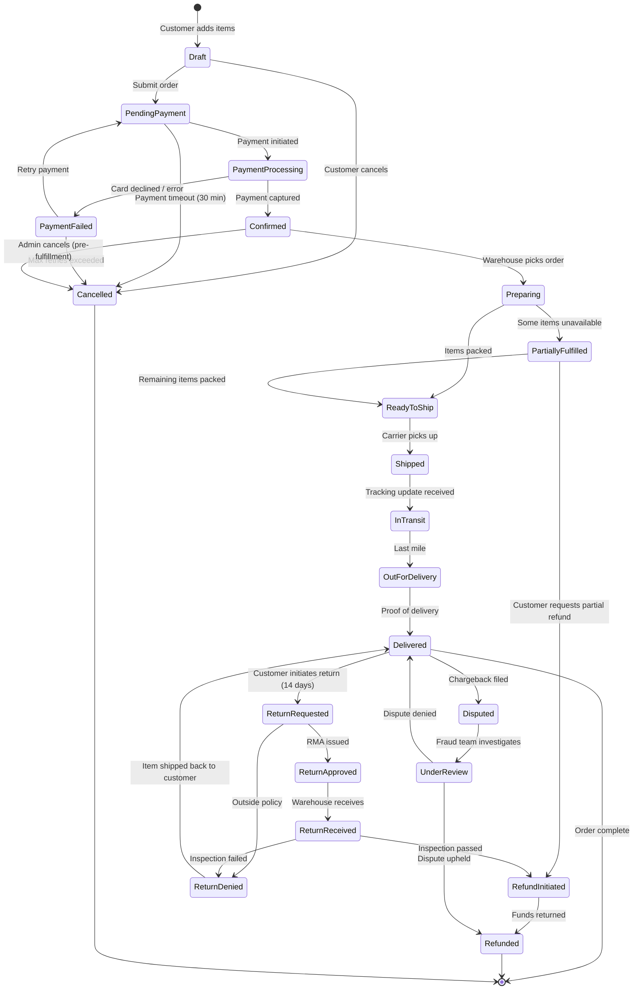

# Order Lifecycle — State Diagram

Complete state machine for an e-commerce order, from cart checkout through
payment processing, fulfillment, shipping, delivery, and all cancellation /
refund / dispute paths.

