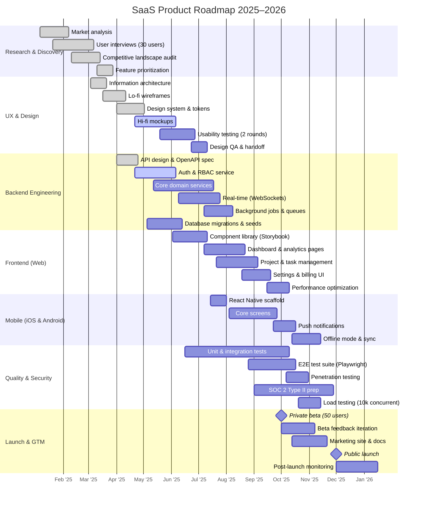

# Product Development Roadmap 2025–2026

Full development timeline for a SaaS product from initial research through
public launch, covering research, design, backend, frontend, mobile, QA,
and go-to-market phases.

## Key Milestones

| Date | Milestone |
|------|-----------|
| Oct 1, 2025 | Private Beta — 50 early access users |
| Dec 1, 2025 | Public Launch — open signup |
| Jan 2026 | Post-launch stabilization complete |
