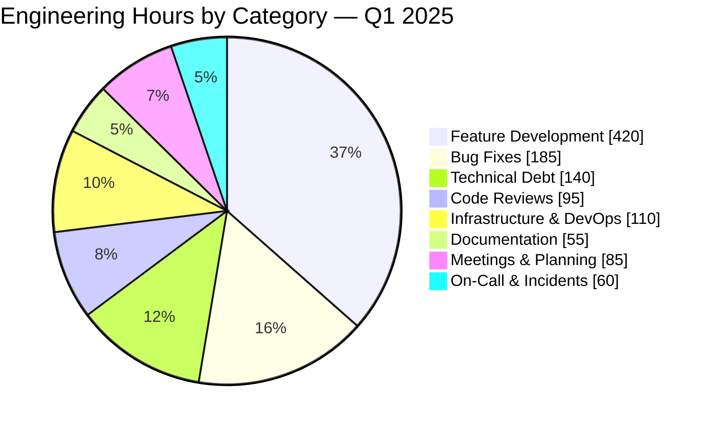

# Engineering Time Distribution — Q1 2025

Breakdown of where the engineering team spent their time during Q1 2025,
based on Jira ticket hours.

## Key Takeaways

- **35%** of time on new features — healthy for a growth-stage product
- **15%** on bug fixes — slightly high, invest in test coverage
- **12%** on tech debt — maintain this cadence to prevent accumulation
- **9%** on infra — largely Kubernetes migration work
- **8%** on code reviews — good collaboration signal
- **5%** on-call — within SRE best practices (< 10%)
