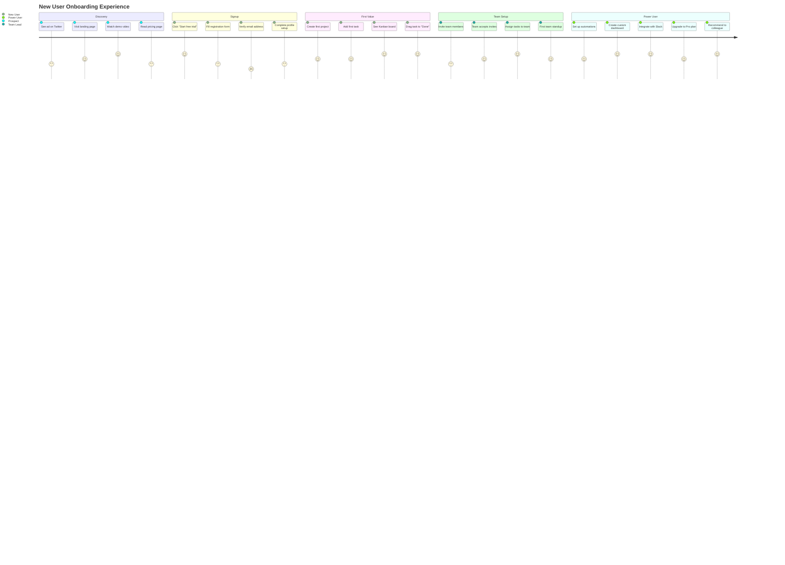

# New User Onboarding Journey

Maps the emotional experience of a new user from first discovering the product
through signup, first value moment, team invitation, and becoming a power user.

```mermaid
journey
    title New User Onboarding Experience
    section Discovery
        See ad on Twitter: 3: Prospect
        Visit landing page: 4: Prospect
        Watch demo video: 5: Prospect
        Read pricing page: 3: Prospect
    section Signup
        Click "Start free trial": 5: New User
        Fill registration form: 3: New User
        Verify email address: 2: New User
        Complete profile setup: 3: New User
    section First Value
        Create first project: 4: New User
        Add first task: 4: New User
        See Kanban board: 5: New User
        Drag task to "Done": 5: New User
    section Team Setup
        Invite team members: 3: Team Lead
        Team accepts invites: 4: Team Lead
        Assign tasks to team: 5: Team Lead
        First team standup: 4: Team Lead
    section Power User
        Set up automations: 4: Power User
        Create custom dashboard: 5: Power User
        Integrate with Slack: 5: Power User
        Upgrade to Pro plan: 4: Power User
        Recommend to colleague: 5: Power User
```
